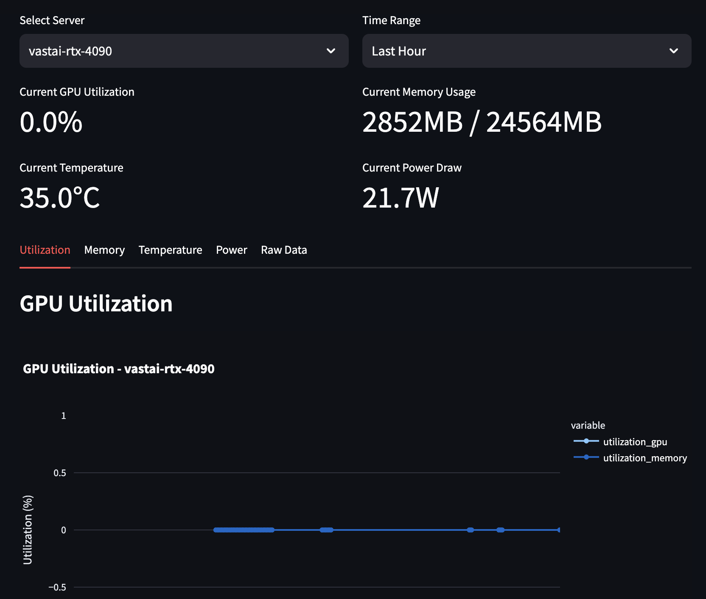

# GPU Stat Monitor

A simple tool to monitor NVIDIA GPU usage on remote machines with minimal setup.



## Overview

GPU Stat Monitor is a Python-based tool that:
1. Connects to remote machines via SSH
2. Collects GPU stats by running `nvidia-smi` commands remotely
3. Stores the data locally in CSV format
4. Provides a web-based dashboard for visualization

## Features

- Single command to start monitoring: `gpu-stat run`
- Multiple remote machine support
- Simple SSH configuration
- Zero setup on remote machines (only requires NVIDIA drivers)
- Metrics tracked:
  - GPU utilization
  - Memory usage
  - Temperature
  - Power consumption
  - Running processes

## Installation

```bash
# install from git url
pip install git+https://github.com/abinthomasonline/gpu-stat.git
```

```bash
# or clone and install
git clone https://github.com/abinthomasonline/gpu-stat.git
cd gpu-stat
pip install .
```

## Usage

### Basic Usage

```bash
# Start monitoring with interactive setup
gpu-stat run --config config.yaml
```

### Configuration File

Create a `config.yaml` file:

```yaml
servers:
  - name: ML Server 1
    host: ml1.example.com
    user: researcher
    key_path: ~/.ssh/ml_key
    interval: 5  # seconds
    port: 12889

  - name: ML Server 2
    host: ml2.example.com
    user: researcher
    key_path: ~/.ssh/ml_key
    interval: 10
    port: 22

settings:
  data_dir: ./data
  default_interval: 5
```

## Project Structure

```
gpu-stat/
├── gpu_stat/
│   ├── __init__.py
│   ├── cli.py            # Command-line interface
│   ├── ssh_client.py     # SSH connection handler
│   ├── data_collector.py # Remote data collection
│   ├── data_store.py     # Local data storage client
│   ├── dashboard.py      # Streamlit dashboard
└── setup.py
```

## Contributing

Contributions are welcome! Please open an issue or submit a pull request.

## License

MIT License - see [LICENSE](LICENSE) for details 
